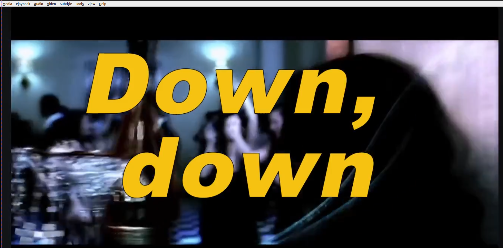
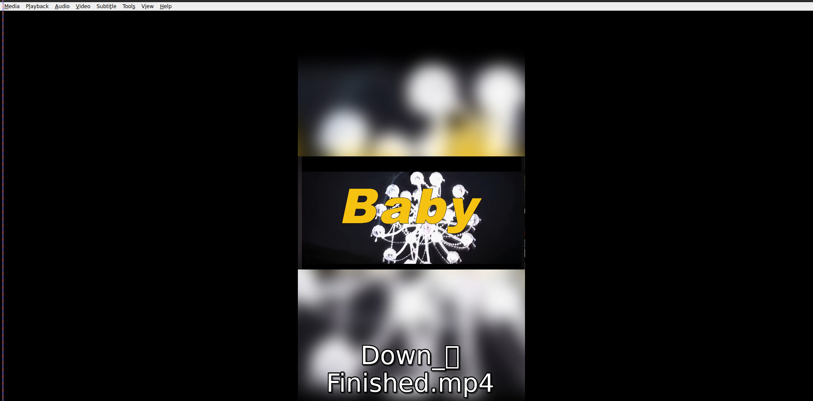

[](README.md)
[](README.es.md)

# 🎬 Vertical Video Automator (FFmpeg + Python)

**Turn horizontal videos into perfect vertical (9:16) content for TikTok, Instagram Reels, and YouTube Shorts — in seconds.**

---

## 🎥 Before & After

<p align="center">
  <strong>Before (Horizontal)</strong><br>
  
</p>

<p align="center">
  <strong>After (Vertical with Blur)</strong><br>
  
</p>

---

## Why This Tool?

Manually converting videos for social media is tedious and time-consuming.  
**Vertical Video Automator** automates the entire process using Python and FFmpeg.

Just drop your horizontal videos in a folder, run the script, and get clean vertical versions with a beautiful blurred background and perfectly centered content — no black bars, no heavy video editors needed.

---

## ✨ Features

- 🎥 **Smart Conversion** — Horizontal to vertical (9:16) format
- 🌫️ **Blurred Background** — Modern look without black bars
- ⚡ **Batch Processing** — Handle multiple videos at once
- 🧠 **Intelligent Centering** — Keeps the main subject well-framed
- 🐍 **Python + FFmpeg** — Lightweight and fast CLI tool

---

## 🚀 Installation & Usage

## ✨ Installation

git clone https://github.com/LuisMongeNarvaez/vertical-video-automator.git
cd vertical-video-automator

# Recommended: use a virtual environment
python -m venv venv
source venv/bin/activate          # On Windows: venv\Scripts\activate

pip install -r requirements.txt

## ✨ Usage

# Process a single video
python src/main.py -i your_video.mp4 -o output_vertical.mp4

# Batch process all videos in a folder
python src/main.py -i ./videos_folder/

### Requirements
- Python 3.8+
- FFmpeg installed and added to your PATH

Check FFmpeg:
```bash
ffmpeg -version
```

## Author Luis Monge Narvaez
GitHub: @LuisMongeNarvaez

## License
This project is licensed under the MIT License — see the LICENSE file for details.

## Contributing 
Contributions are welcome!
Feel free to open an issue for bugs or feature requests, or submit a pull request to improve the code or documentation.


